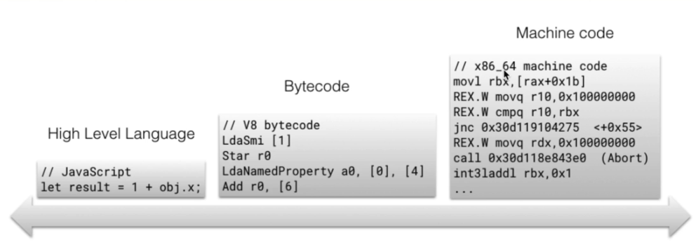

# Section 1

## Javascript engine

Computers only understand ones and zeroes. Javascript is not something they understand.

By having a Javascript engine, you can translate Javascript to ones and zeroes.

There are a lot of [Javascript engines](https://en.wikipedia.org/wiki/List_of_ECMAScript_engines), and they are called ECMAScript engines, well see why later.

Most popular: V8 (written in C++), SpiderMonkey, Chakra.

---

### Who created the first Javascript engine?

Breandan Eich, the creator of Javascript, he created SpiderMonkey, which is what Firefox still uses.

---

This is the process it follows:

It applies a lexical analysis to the **JS File**, which breaks the code into **Tokens**, to identify their meaning, so we know what the code is trying to do. These tokens are formed into an asset we call **Abstract syntax tree (AST)**

To view a visual representation of what this AST looks like, I'll leave this tool called [AST explorer](https://astexplorer.net/), which lets you write some <font color="green">Javascript code </font> and then transform it onto AST or an equivalent <font color="red">JSON</font>.

After interpreting it well have a Bytecode,

But if we want to have optimized code, well need a Profiler and a Compiler too.

---

### Why are they called ECMAScript engines and not JS engines?

ECMAScript was created to tell engine creators how Javascript should work.

---

## Interpreters and compilers

In programming there are two ways of translating to machine language or what our computers understand.

### Interpreter
Translate and read the file line by line on the fly

```JS
function someCalculation(x, y) {
    return x + y;
};

for(let i = 0; i < 1000; i++ ) {
    someCalculation(5, 4);
}
```

### Compiler
Creates a translation before execution.



---
### Babel and Typescript

**Babel** is a Javascript compiler that takes your modern JS code and returns browser compatible JS (older JS code).
**Typescript** is a superset of Javascript that compiles down to Javascript.

---

### Why choosing compiler or interpreter?

An interpreter allows you instantly run a file.

A compiler has optimization for code, but it takes a bit more time to run at the beginning.

### Isn't there a way to get best of both worlds?

In late 2000 JIT Compiler was born. It mixes some features of both worlds.