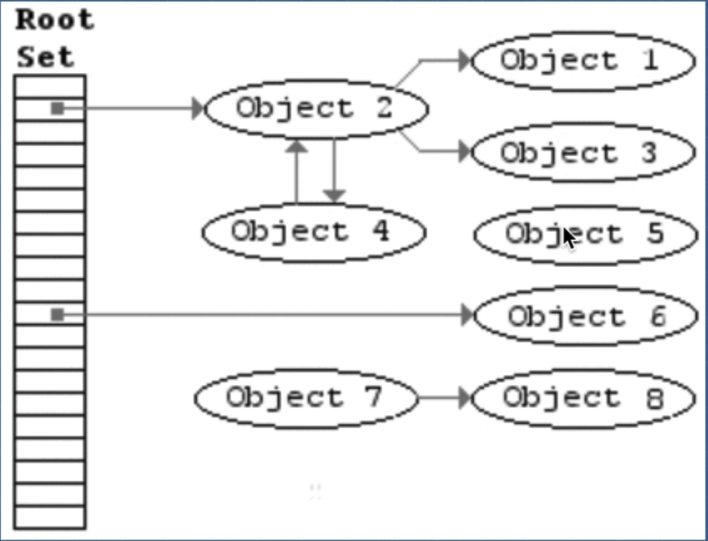
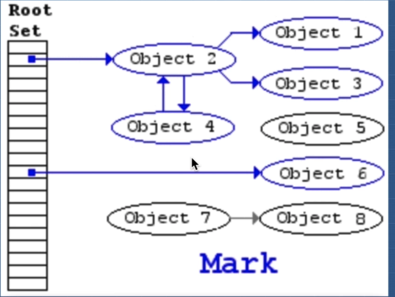
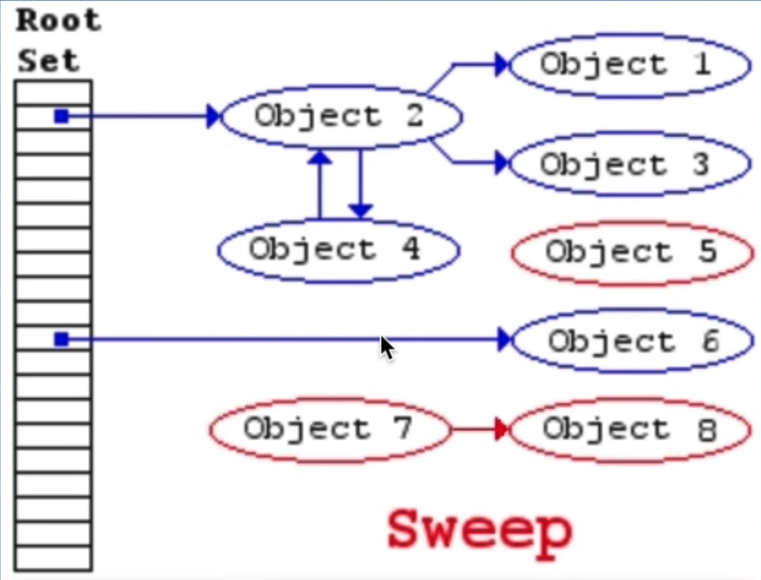
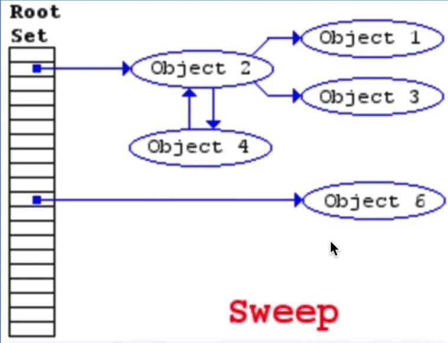
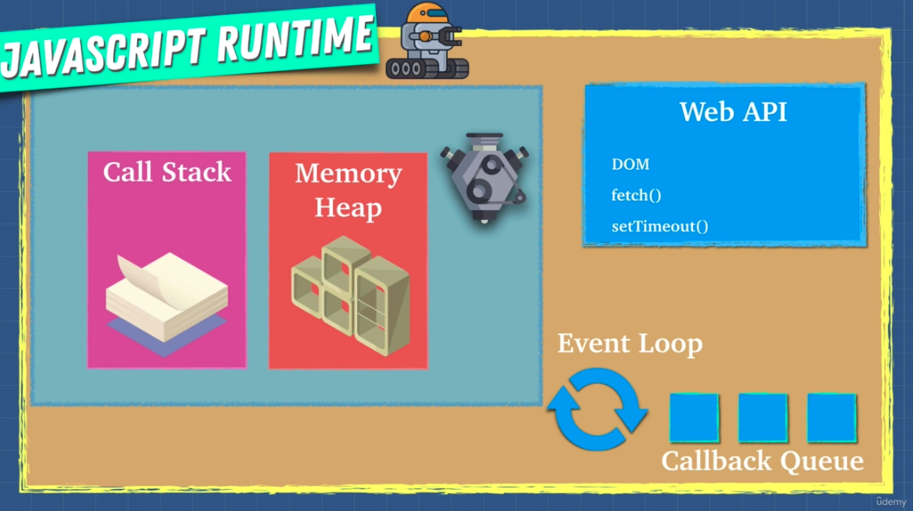

# Section 1

## Javascript engine

Computers only understand ones and zeroes. Javascript is not something they understand.

By having a Javascript engine, you can translate Javascript to ones and zeroes.

There are a lot of [Javascript engines](https://en.wikipedia.org/wiki/List_of_ECMAScript_engines), and they are called ECMAScript engines, well see why later.

Most popular: V8 (written in C++), SpiderMonkey, Chakra.

---

### Who created the first Javascript engine?

Breandan Eich, the creator of Javascript, he created SpiderMonkey, which is what Firefox still uses.

---

This is the process it follows:

It applies a lexical analysis to the **JS File**, which breaks the code into **Tokens**, to identify their meaning, so we know what the code is trying to do. These tokens are formed into an asset we call **Abstract syntax tree (AST)**

To view a visual representation of what this AST looks like, I'll leave this tool called [AST explorer](https://astexplorer.net/), which lets you write some <font color="green">Javascript code </font> and then transform it onto AST or an equivalent <font color="red">JSON</font>.

After interpreting it well have a Bytecode,

But if we want to have optimized code, well need a Profiler and a Compiler too.

---

### Why are they called ECMAScript engines and not JS engines?

ECMAScript was created to tell engine creators how Javascript should work.

---

### Interpreters and compilers

In programming there are two ways of translating to machine language or what our computers understand.

### Interpreter
Translate and read the file line by line on the fly

```JS
function someCalculation(x, y) {
    return x + y;
};

for(let i = 0; i < 1000; i++ ) {
    someCalculation(5, 4);
}
```

### Compiler
Creates a translation before execution.


---
### Babel and Typescript

**Babel** is a Javascript compiler that takes your modern JS code and returns browser compatible JS (older JS code).
**Typescript** is a superset of Javascript that compiles down to Javascript.

---

### Why choosing compiler or interpreter?

An interpreter allows you instantly run a file.

A compiler has optimization for code, but it takes a bit more time to run at the beginning.

### Isn't there a way to get best of both worlds?

In late 2000 JIT Compiler was born. It mixes some features of both worlds.

### How to help the javascript engine?

We need know what this next concepts are in order to understand what to do in some rare cases

 - eval()
 - arguments
 - for in
 - with 
 - delete
 - hidden classes
 - inline caching

### Inline caching

```JS
// inline caching

const findUser = (user) => {
    return `Found ${user.firstName} ${user.lastName}`
};

const userData {
    firstName: 'Santiago',
    lastName: 'Siordia',
};

findUser(userData);
// If we repeat the above line with the same input
// the compiler will return the inline cached value
// 'Found Santiago Siordia'
// this helps optimizing the performance of the code.
```

### Hidden classes

```JS
// This next code makes the compiler deoptimize the code (runs slower)
function Animal(x, y) {
    this.x = x;
    this.y = y;
    // A good option to add new properties would be setting them right here where the constructor sets them.
}

const obj1 = new Animal(1, 2);
const obj2 = new Animal(3, 4);

obj1.a = 30;
obj1.b = 100;

obj1.b = 30; // Assigning new values in no order like this would cause JS to infer this is a different class than what was used before
obj1.a = 100;


```

In the same way, using the `delete` keyword would cause some misperformance.

```JS
delete obj1.x // Hidden clases don't match anymore 
```

We should write code that is predictable. Not only for humnas but for machines as well.

### Call stack and memory heap

Javascript does a lot of things for us, but th ebiggest thing is reading the code and executing it. This

We need a place to store our variables and a place to run and keep track of  whats happening in our code.

That's call stack and memory heap.

We need the **memory heap** as a place to store and write information.

**Memory heap** is where the memory allocation happens

We need a **call stack** to keep track of what place we are in the code, so we can run it in order.

[Javascript example](./resources/callstack&memoryHeap.js)


### Stack overflow

A stack overflow means the call stack is already full and we are continuing to add more framse

### Memory heap how it works.

Javascript gives you a false sense of security with its garbage collector. No system is perfect!






### Causing a memory leak

[Javascript example](./resources/memoryLeak.js);

Main [three memory leaks](./resources/memoryLeakTypes.js) in normal code:
 - Global variables.
 - Event listeners.
 - setInteval referencing objects inside function

Memory is limited!

### Single thread

It just has one callstack and one memory heap, we will never run two functions in paralell.

### Issue with single thread

Long running tasks are the main issue.

JS is really single threated? Well... now I know that this is kind of a lie. 

## Javascript Runtime!



### Web API

Comes with the browser. All of them have a JS runtime implementation.

This is used to send HTTP reqs, DOM changes, caching, data base storage on browser.

These APIs are built in low levels languages to take advantage of their own garbage collection. And these APIs are what we call **ASYNCHONOUS**.

### Event loop and Callback queue

**Just scratching the surface of this topic!**

What is this thing?

When we have some `setTimeout` for example, Javascript only knows that it needs to go to the web API for it to handle it properly. JS doesn't natively know what to do with it. The Web API waits for the specified amount of miliseconds and then sends the function to the Callback queue, when it is its turn, the event loop tells Javascript "Hey, I got this function here, now that you're free: execute it."

[Let's do an excercise](./resources/eventLoopAndCallbackQueue.js)

[This](http://latentflip.com/loupe/?code=ZnVuY3Rpb24gcHJpbnRIZWxsbygpIHsNCiAgICBjb25zb2xlLmxvZygnSGVsbG8gZnJvbSBiYXonKTsNCn0NCg0KZnVuY3Rpb24gYmF6KCkgew0KICAgIHNldFRpbWVvdXQocHJpbnRIZWxsbywgMzAwMCk7DQp9DQoNCmZ1bmN0aW9uIGJhcigpIHsNCiAgICBiYXooKTsNCn0NCg0KZnVuY3Rpb24gZm9vKCkgew0KICAgIGJhcigpOw0KfQ0KDQpmb28oKTs%3D!!!PGJ1dHRvbj5DbGljayBtZSE8L2J1dHRvbj4%3D) is a tool to help understand how the call stack, event loop and callback queue interact with one another.

### Runtime VS Engine

A good way to explain this is 