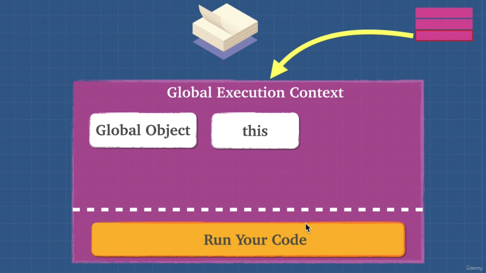
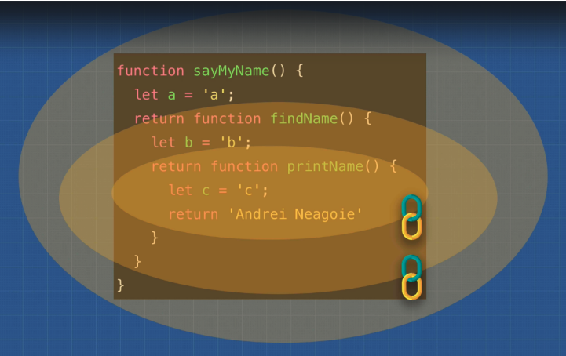
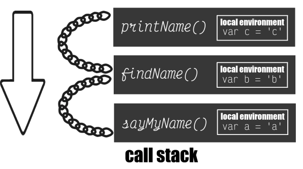

# Section 2: Javascript foundations II

## Execution context
---
[Javascript file to remember](./resources/executionContext.js)

Code in JavaScript is always ran inside a type of **execution context**. Execution context is simply the environment within which your code is ran. There are 2 types of execution context in JavaScript, global or function. There are 2 stages as well to each context, the creation and executing phase. As the JavaScript engine starts to read your code, it creates something called the **Global Execution Context**.

### Global Execution context

- Creation phase
    1. Global object is created
    2. Initializes `this` keyword to global
- Executing phase
    3. Variable Environment created - memory space for `var` variables and `function`s created
    4. Initializes all variables to `undefined` (also known as **hoisting**) and places them with any functions into memory

```JS
this;
window;
this === window;
// Window {...}
// Window {...}
// true
```



### Functional execution context

A `function` context is created by the Javascript engine when it sees a function call. Each function gets its own execution context.

- Creation phase
	1. **Argument object** created with any arguments
	2. Sets `this` to the global object unless in strict mode, where it's undefined.
- Executing phase
	3. **Variable Enviroment** created - memory space for variable and functions created
	4. Initializes all variables to undefined and places them into memory with any new functions.

```JS
function showArgs(arg1, arg2) {
	console.log("arguments: ", arguments);
	return `argument 1 is: ${arg1} and argument 2 is: ${arg2}`;
}

showArgs("Hello", "World!");

// arguments: { 0: "Hello", 1: "World!" }
// argument 1 is Hello and argument 2 is World!

function noArgs() {
	console.log("arguments: ", arguments);
};

noArgs();

// arguments: {}
// even though there are no arguments, the object is still created.

```

```JS
function showArgs(arg1, arg2){
	console.log("arguments: ", arguments);
	console.log(Array.from(arguments));
};

showArgs("Hello", "World!");

// arguments: { 0: "Hello", 1: "World!" }
// [ "Hello", "World!" ]

function showArgs2(...args) {
	console.log("arguments: ", args);
	console.log(Array.from(arguments));
	return `${args[0]} ${args[1]}`
}

showArgs2("Hello", "World!");

// arguments: [ "Hello", "World!" ]
// [ "Hello", "World!" ]
// Hello World!

```

The keyword arguments can be dangerous to use in your code as is. In ES6, a few methods were introduced that can help better use arguments.

### Arrow functions

    Some people think of arrow functions as just being syntactic sugar for a regular function, but arrow functions work a bit differently than a regular function. They are a compact alternative to a regular function, but also without its own bindings to `this`, `arguments`, `super`, or `new` target keywords. Arrow functions cannot be used as constructors and are **NOT** the best option for methods.

```JS

var obj = {
    // does not create a new scope
    i: 10,
    b: () => console.log(this.i, this),
    c: function() {
        console.log(this.i, this);
    }
}

obj.b(); // prints undefined, Window {...} (or the global object)
obj.c(); // prints 10, Object {...}

```

## Hoisting
----

Hoisting is the process of putting **all variable and function** declarations into memory during the **compile phase**. In JavaScript, `function`s are fully hoisted, `var` variables are hoisted and initialized to `undefined`, and `let` and `const` variables are hoisted but not initialized a value. `var` variables are given a **memory allocation** and initialized a value of `undefined` until they are set to a value in line. So if a `var` variable is used in the code before it is initialized, then it will return `undefined`. However, a `function` can be called from anywhere in the code base because it is **fully hoisted**. If `let` and `const` are used before they are declared, then they will throw a reference error because they have not yet been initialized. 

### Takeaways

Avoid hoisting when possible. It can cause memory leaks and hard to catch bugs in your code. Use `let` and `const` as your go to variables.

```JS
 // function expression gets hoisted as undefined
var sing = function() {
 console.log("uhhhh la la la");
}

// function declaration gets fully hoisted
function sing2() {
	console.log("ohhhh la la la");
}
```

```JS

// function declaration gets hoisted
function a() {
	console.log("Hi");
};

// function declaration gets rewritten in memory
function a() {
	console.log("bye");;
};

a();
// bye

```

```JS

// variable declaration gets hoisted as undefined
var favoriteFood = "grapes";

// function expression gets hoisted as undefined
var foodThoughts = function () {
	//new execution context created favoriteFood = undefined
	console.log(`Original favorite food: ${favoriteFood}`);
	
	// variable declaration gets hoisted as undefined
	var favoriteFood = "sushi";
	
	console.log(`New favorite food: ${favoriteFood}`)
};

foodThought();

```

## Lexical environment
---

A lexical environment is basically the scope or environment the engine is currently reading code in. A new lexical environment is created when curly brackets `{}` are used, even nested brackets `{{...}}` create a new lexical environment. The execution context tells the engine which lexical environment it is currently working in and the lexical scope determines the available variables.
 
```JS

function one() {  
	var isValid = true; // local env
	two(); // new execution context
} 
function two() {  
} 

var isValid = false; // global
one(); 

/*
 two() isValid = undefined 
 one() isValid = true 
 global() isValid = false 
 ------------------------ 
 call stack 
*/

```

## Scope Chain
---



Each environment context that is created has a link outside of its lexical environment called the **scope chain**. The **scope chain** gives us access to variables in the parent environment.

```JS
var x = "x"; 

function findName() { 
 console.log(x); 
 var b = "b"; 
 return printName(); 
} 

function printName() { 
 var c = "c"; 
 return "Brittney Postma"; 
} 

function sayMyName() { 
 var a = "a"; 
 return findName(); 
} 

sayMyName();

// sayMyName runs a = 'a'
// findName runs
// x
// b = 'b'
// printName runs c = 'c'
// Brittney Postma

```

In this example, all the functions have access to the global variable x, but trying to access a variable from another function would return an error. The example below will show how the scope chain links each function.

```JS

function sayMyName() { 
	var a = "a"; 
	console.log(b, c); // returns error
	return function findName() { 
		var b = "b"; 
		console.log(a); // a
		console.log(c); // returns error
		return function printName() { 
			var c = "c"; 
			console.log(a, b); // a, b
		}; 
	}; 
};

sayMyName()()(); //each function is returned and has to be called

```

In this example, you can see that the functions only get access to the variables in their parent container, not a child. The scope chain only links down the call stack, so you  almost have to think of it in reverse. It goes up to the parent, but down the call stack.



## JS is weird!
---
Variable leakage and reference error calling non-anonymous function expression

```JS

// It asks global scope for height.
// Global scope says: ummm... no but here I just created it for you.
// We call this leakage of global variables.
// Adding 'use strict' to the file prevents this and causes an error.
function weird() { 
 	height = 50; 
} 
var heyhey = function doodle() { 
 	// code here
}; 

heyhey(); 
doodle(); // Error! because it is enclosed in its own scope.

```

## Function and block scope
---
Most programming languages are block scoped, meaning every time you see a new `{}` (curly braces) is a new lexical environment. However, JavaScript is functionally scoped, 
meaning it only creates a new local environment if it sees the keyword function on the 
global scope. To give us access to block scope, in ES6 `let` and `const` were added to the language. Using these can prevent memory leaks, but there is still an argument to be 
made for using `var`.

```JS

//Function Scope

function loop() { 
	for (var i = 0; i < 5; i++) { 
		console.log(i); 
	} 
	console.log("final", i); // returns final 5
} 

//Block Scope

function loop2() { 
	for (let i = 0; i < 5; i++) { 
		// can access i here
	} 
	console.log("final", i); // returns an error here
} 
loop(); 
/* 
	1 
	2 
	3 
	4 
	final 5 
*/
loop2(); // ReferenceError: i is not defined

```

### `let` and `const`

Variable declarations with `let` and `const` work differently from the `var` variable declaration. When a lexical scope is entered and the execution context is created, the engine allocates memory for any var variable in that scope and initializes it to `undefined`. The `let` and `const` variables only get initialized on the line they are executed on and only get allocated `undefined` if there is no assignment to the variable. Trying to access a `let` or `const` variable before it is declared or outside of its block without returning it will result in a `Reference Error`.

## IIFE - Immediately invoked function expression
---
Immediately Invoked Function Expression or more simply **IIFE** is a JavaScript function that runs as soon as it is defined. Can also be referred to as a Self-Executing Anonymous Function.

```JS
// Grouping Operator () creates a lexical scope

(function() { 
	// statements
})(); 

// Immediately invokes the function with 2nd set of ()
```

### Takeaways
Avoid polluting the global namespace or scope when possible

## this
---
