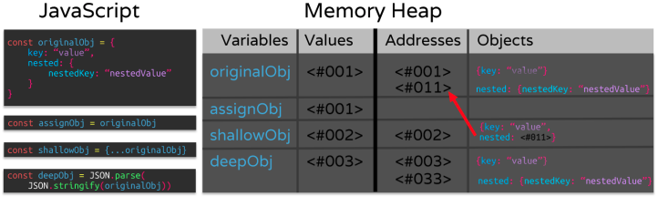
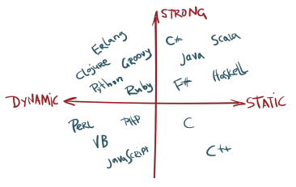

# Javascript types!

```JS
// Numbers
typeof 37 === "number"; 
typeof 3.14 === "number"; 
typeof 42 === "number"; 
typeof Math.LN2 === "number"; 
typeof Infinity === "number"; 
typeof NaN === "number"; // Despite being "Not-A-Number"
typeof Number("1") === "number"; // Number tries to parse things into numbers
typeof Number("shoe") === "number"; // including values that cannot be type coerced to a number
typeof 42n === "bigint"

// Strings
typeof "" === "string"; 
typeof "bla" === "string"; 
typeof `template literal` === "string"; 
typeof "1" === "string"; // note that a number within a string is still typeof string
typeof typeof 1 === "string"; // typeof always returns a string
typeof String(1) === "string"; // String converts anything into a string, safer than toString
// Booleans
typeof true === "boolean"; 
typeof false === "boolean"; 
typeof Boolean(1) === "boolean"; // Boolean() will convert values based on if they're truthy or falsy
typeof !!1 === "boolean"; // two calls of the ! (logical NOT) operator are equivalent to Boolean()

// Symbols
typeof Symbol() === "symbol";
typeof Symbol("foo") === "symbol";
typeof Symbol.iterator === "symbol";

// Undefined
typeof undefined === "undefined";
typeof declaredButUndefinedVariable === "undefined";
typeof undeclaredVariable === "undefined";

// Objects
typeof { a: 1 } === "object";
// use Array.isArray or Object.prototype.toString.call
// to differentiate regular objects from arrays
typeof [1, 2, 4] === "object";
typeof new Date() === "object";
typeof /regex/ === "object"; // See Regular expressions section for historical results
// The following are confusing, dangerous, and wasteful. Avoid them.
typeof new Boolean(true) === "object";
typeof new Number(1) === "object";
typeof new String("abc") === "object";

// Functions
typeof function() {} === "function"; 
typeof class C {} === "function"; 
typeof Math.sin === "function";
```

## Objects in Javascript

Objects are one of the broadest types in JavaScript, almost "*everything*" is an object. [MDN Standard built-in](https://developer.mozilla.org/en-US/docs/Web/JavaScript/Reference/Global_Objects) objects

- Booleans can be objects (if defined with the new keyword)
- Numbers can be objects (if defined with the new keyword)
- Strings can be objects (if defined with the new keyword)
- Dates are always objects
- Maths are always objects
- Regular expressions are always objects
- Arrays are always objects
- Functions are always objects
- Objects are always objects

## Primitive vs. Non Primitive

**Primitive** - Primitive values are defined by being immutable, they cannot be altered. The variable assigned to a primitive type may be reassigned to a new value, but the original value can not be changed in the same way objects can be modified. Primitives are **passed by value**, meaning their values are copied and then placed somewhere else in the memory. They are also compared by value. There are currently 7 primitive data types in JavaScript.

- string
- number
- bigint
- boolean
- null
- undefined
- symbol

**Non Primitive** - The only type that leaves us with is objects. Objects are able to be mutated and their properties are **passed by reference**, meaning their properties are not stored separately in memory. A new variable pointing to an object will not create a copy, but reference the original objects location in memory. Therefore, changing the 2nd object will also change the first.

```JS
// objects are passed by reference
let obj = { 
    name: "object 1"
}; 
let newObj = obj; // points to same place in memory as obj
newObj.name = "newObj"; // modifies the memory
// Since both point to the same place...
console.log(obj); // {name: newObj}
console.log(newObj); // {name: newObj}
// They are both modified.
let arr = [1, 2, 3]; 
let newArr = arr; 
newArr.push(4); 
console.log(arr); // [1, 2, 3, 4]
console.log(newArr); // [1, 2, 3, 4]

```

There are two ways to get around this, `Object.assign()` or use the spread operator `{...}` to "spread" or expand the object into a new variable. By doing this, it will allow the new variable to be modified without changing the original. However, these only create a "shallow copy".

> **Shallow copy:** Shallow copy is a bit-wise copy of an object. A new object is created that has an exact copy of the values in the original object. If any of the fields of the object are references to other objects, just the reference addresses are copied i.e., only the memory address is copied.

> **Deep copy:** A deep copy copies all fields, and makes copies of dynamically allocated memory pointed to by the fields. A deep copy occurs when an object is copied along with the objects to which it refers.

> [Understanding Deep and Shallow Copy](https://medium.com/@manjuladubeunderstanding-deep-and-shallow-copy-in-javascript-13438bad941c)

```JS
const originalObj = { 
 nested: { 
    nestedKey: "nestedValue"
 }, 
 key: "value"
}; 
// originalObj points to location 1 in memory
const assignObj = originalObj; 
// assignObj will point to 1 in memory
const shallowObj = { ...originalObj }; 
// shallowObj points to a new location 2, but references location 1 for the nested 
object
const deepObj = JSON.parse(JSON.stringify(originalObj)); 
// deepObj clones all parts of the object to a new memory address
```



```JS
onst originalObj = { 
    nested: { 
        nestedKey: "nestedValue"
    }, 
    key: "value"
}; 

const assignObj = originalObj;
const shallowObj = { ...originalObj };
const deepObj = JSON.parse(JSON.stringify(originalObj));

console.log("originalObj: ", originalObj);
console.log("assignObj: ", assignObj);
console.log("shallowObj: ", shallowObj);
console.log("deepObj: ", deepObj);
/* 
originalObj: {
    nested: { 
        nestedKey: "changed value" 
    },
    key: "changed value"
}

assignObj: {
    nested: { 
        nestedKey: "changed value" 
    },
    key: "changed value"
} 
shallowObj: {
    nested: { 
        nestedKey: "changed value" 
    },
    key: "value"
} 
deepObj: {
    nested: { 
        nestedKey: "nestedValue" 
    },
    key: "value"
} 
*/
```

> **Nifty Snippet:** If you try to check if 2 objects with the same properties are equal with obj1 = obj2, it will return false. It does this because each object has its own address in memory as we learned about. The easiest way to check the contents of the objects for equality is this.

```JS
JSON.stringify(obj1) === JSON.stringify(obj2);
```

This will return `true` if all properties are the same and in the same order.

## Type coercion

**Type coercion** is the process of converting one type of value into another. There are 3 types of conversion in JavaScript.

- to string
- to boolean
- to number

```JS
let num = 1; 
let str = "1"; 
num == str; // true
// notice loose equality ==, not ===
// double equals (==) will perform a type conversion
// one or both sides may undergo conversions
// in this case 1 == 1 or '1' == '1' before checking equality
```

> Strict equals: The triple equals (`===`) or strict equality compares two values without type coercion. If the values are not the same type, then the values are not equal. This is almost always the right way to check for equality in JavaScript, so you don't accidentally coerce a value and end up with a bug in your program. Here is the [MDN Equality Comparison](https://developer.mozilla.org/en-US/docs/Web/JavaScript/Equality_comparisons_and_sameness) page and 
the [ECMAScript Comparison Algorithm](https://262.ecma-international.org/5.1/#sec-11.9.3)

There are several edge cases that you will come in contact with in JavaScript as well. Check out this [Comparison Table](https://dorey.github.io/JavaScript-Equality-Table/) if you have questions about how types are coerced.

### Static vs Dynamic typed

The major difference between static and dynamic typed languages is when the types of variables are checked. Static typed languages (Java, C, C++, C#) are checked during the compile stage, so all types are known before run-time. Dynamic languages (JavaScript, PHP, Python, Ruby, Perl) are checked on the fly, during the execution stage. Also, after dividing the languages into dynamic and static, they are then divided again into **strong** and **weak** typed. Weakly typed (JavaScript, PHP, C, C++) languages can make type coercions implicitly while strongly typed (Python, Ruby, C#, Java) do not allow conversions between unrelated types.

