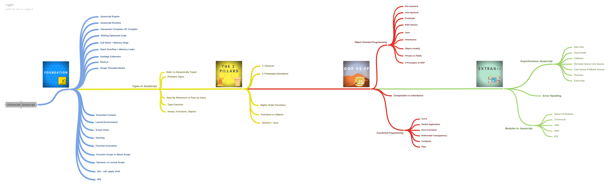

# Objective

Understand advanced concepts of Javascript.

- [Section 1: JS Foundations](./Section%201)
- [Section 2: JS Foundations II](./Section%202)
- [Section 3: Types in JavaScript](./Section%203)
- [Section 4: The two pillars: Closures and prototypal inheritance](./Section%204)
- [Section 6: Object oriented programming](./Section%206)
- [Section 7: Functional programming](./Section%207)
- [Section 8: OOP vs FP](./Section%208)
- [Section 9: Asynchronous JS](./Section%209)
- [Section 10: Modules in JavaScript](./Section%2010)
- [Section 11: Error handling](./Section%2011)
- [Section 13: Data structures in JS](./Section%2012)
- [Section 14: Javascript Basics (?)](./Section%2013)
- [Section 15: Intermidiate JS](./Section%2014)
- [Section 16: Extra bits(?)](./Section%2015)

## What are advanced concepts in JavaScript?
---

Here's a [diagram](https://coggle.it/diagram/XE3ZoVj-rtA5hcxj/t/advanced-javascript) of what I'm trying to learn

